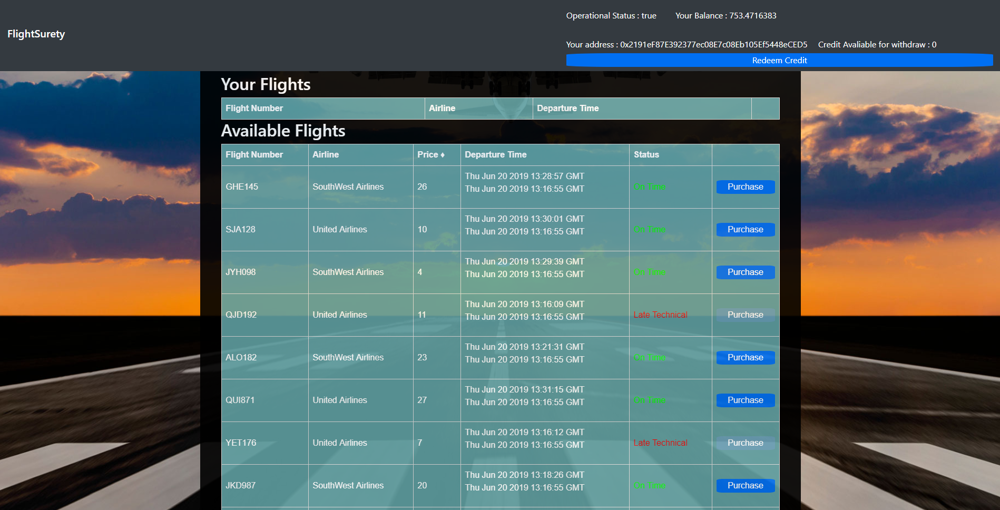
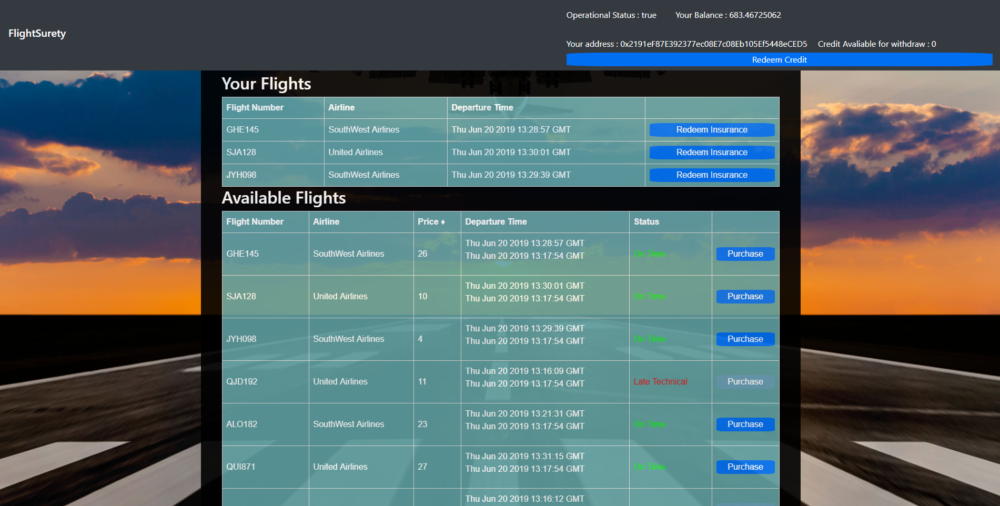

# FlightSurety

FlightSurety is a blockchain smart contract that allows for purchasing insurance on airline flights. Including a browser UI allowing for contact interaction.

## Install

This repository contains Smart Contract code in Solidity (using Truffle), tests (also using Truffle), dApp scaffolding (using HTML, CSS and JS) and server app scaffolding.

To install, download or clone the repo, then:

`npm install`

Make sure you already have truffle installed:

`npm install -g truffle`

`truffle compile`

#### Launch Ganache with following settings.

Mnemonic: `candy maple cake sugar pudding cream honey rich smooth crumble sweet treat`

Amount of accounts: `40`

Price pure account: `1000`

gas limit: `3000000000`

#### Migrate contract to ganache.

`truffle migrate --reset`

## Develop Client

Test files

To run truffle tests:

`truffle test ./test/Insurance.js`

`truffle test ./test/airlines.js`

`truffle test ./test/flightSurety.js`

`truffle test ./test/oracles.js`

## Start the server

Register oracles, airlines and flights:

`npm run server`

## Start webserver

Dapp server:

`npm run dapp`

To view dapp:

`http://localhost:8000`

## Dapp Images

Hopefully the UI is self explanatory.

Note: status updates are automatically requested 5 seconds before the flight departes.

## Resources

* [How does Ethereum work anyway?](https://medium.com/@preethikasireddy/how-does-ethereum-work-anyway-22d1df506369)
* [BIP39 Mnemonic Generator](https://iancoleman.io/bip39/)
* [Truffle Framework](http://truffleframework.com/)
* [Ganache Local Blockchain](http://truffleframework.com/ganache/)
* [Remix Solidity IDE](https://remix.ethereum.org/)
* [Solidity Language Reference](http://solidity.readthedocs.io/en/v0.4.24/)
* [Ethereum Blockchain Explorer](https://etherscan.io/)
* [Web3Js Reference](https://github.com/ethereum/wiki/wiki/JavaScript-API)
